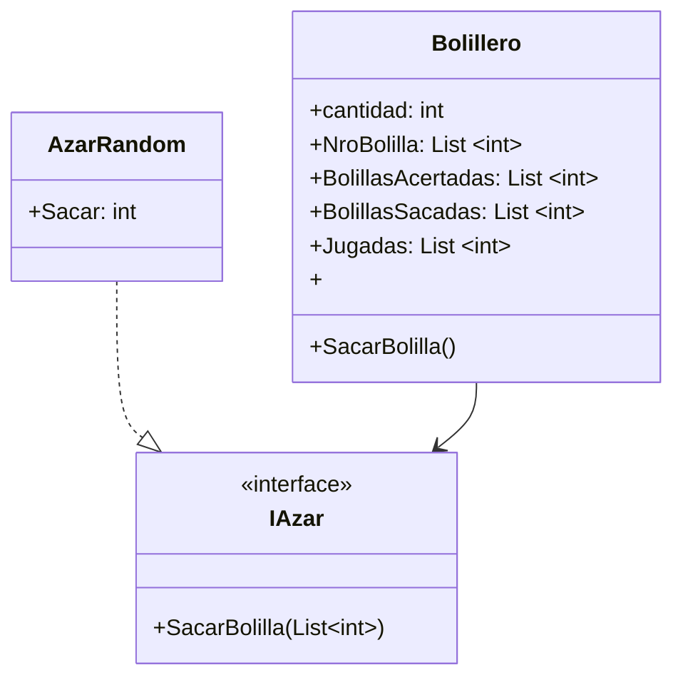

```mermaid
classDiagram

class Bolillero{
    +cantidad: int
    +NroBolilla: List ~int~
    +BolillasAcertadas: List ~int~
    +BolillasSacadas: List ~int~
    +Jugadas: List ~int~
    +
    +SacarBolilla()


}


class IAzar{
    <<interface>>
    +SacarBolilla(List~int~)
}


class AzarRandom{
    +Sacar: int
}

 AzarRandom ..|>  IAzar
 Bolillero --> IAzar
```

