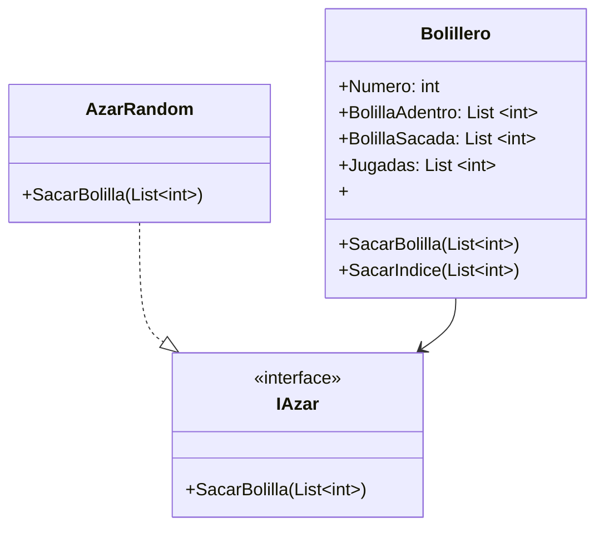

```mermaid
classDiagram

class Bolillero{
    +Numero: int
    +BolillaAdentro: List ~int~
    +BolillaSacada: List ~int~
    +Jugadas: List ~int~
    +
    +SacarBolilla(List~int~)
    +SacarIndice(List~int~)


}


class IAzar{
    <<interface>>
    +SacarBolilla(List~int~)
}


class AzarRandom{
    +SacarBolilla(List~int~)
}

 AzarRandom ..|>  IAzar
 Bolillero --> IAzar 
```

